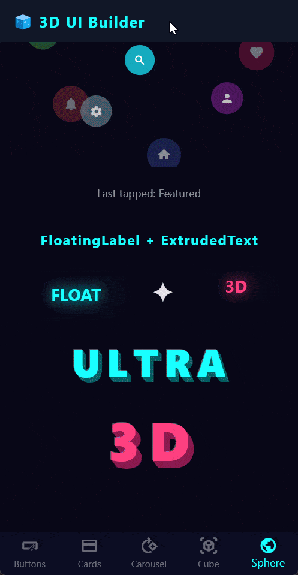
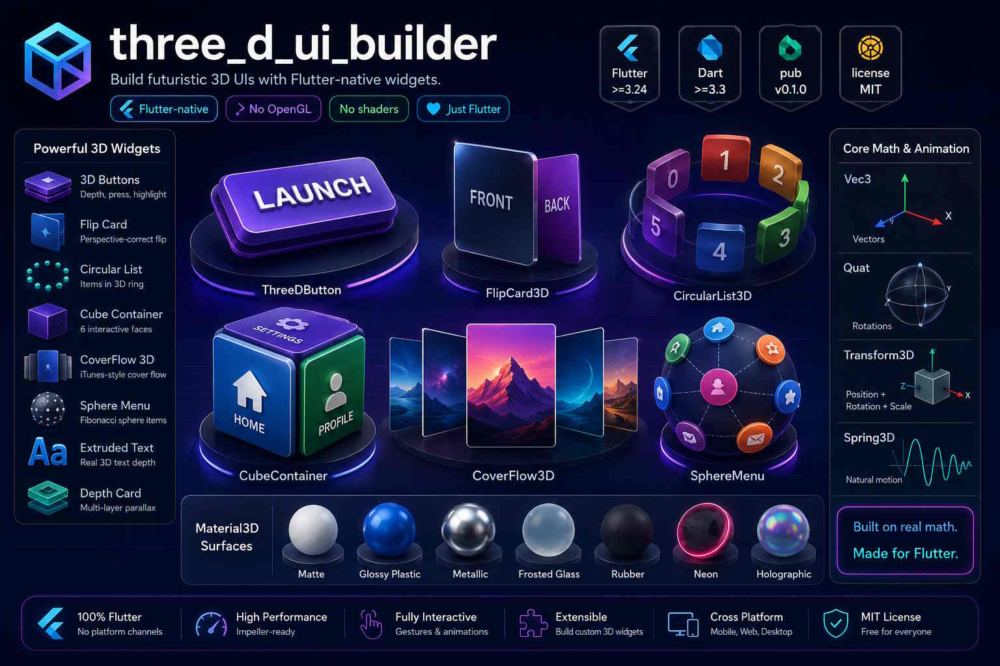

# three_d_ui_builder

> Build futuristic 3D UIs with Flutter-native widgets.  
> No OpenGL. No shaders. No GPU scene-graph boilerplate.  
> Just Flutter.

[](https://pub.dev/packages/three_d_ui_builder)
[](LICENSE)
[](https://flutter.dev)
[](https://dart.dev)

---








## Why three_d_ui_builder?

Most Flutter 3D solutions fall into one of two traps:

| Problem | Example |
|---------|---------|
| **Dead / unmaintained** | `flutter_3d` — no commits since 2021, broken on Flutter 3+ |
| **Too low-level** | `flutter_scene` — excellent GPU engine, but you must work with raw geometry and scene nodes |

`three_d_ui_builder` sits in the gap: it gives you fully interactive 3D widgets with a **widget-tree API identical to the one you already know**.

```dart
// Before — plain Flutter
ElevatedButton(child: Text('Buy'), onPressed: buy);

// After — same idea, 3D depth effect included
ThreeDButton(label: Text('Buy'), depth: 8, onPressed: buy);
```

No vertex buffers. No GLSL. No Impeller flags. Just widgets.

---

## Installation

Add the dependency to your `pubspec.yaml`:

```yaml
dependencies:
  three_d_ui_builder: ^0.1.0
```

Then run:

```sh
flutter pub get
```

Import the single barrel file in any Dart file:

```dart
import 'package:three_d_ui_builder/three_d_ui_builder.dart';
```

---

## Quick Start

Wrap your app (or any subtree) with `ThreeDTheme` to configure global defaults, then drop in any widget:

```dart
import 'package:flutter/material.dart';
import 'package:three_d_ui_builder/three_d_ui_builder.dart';

void main() => runApp(const MyApp());

class MyApp extends StatelessWidget {
  const MyApp({super.key});

  @override
  Widget build(BuildContext context) {
    return ThreeDTheme(
      data: ThreeDThemeData.defaults(),
      child: MaterialApp(
        title: '3D UI Demo',
        home: const HomePage(),
      ),
    );
  }
}

class HomePage extends StatelessWidget {
  const HomePage({super.key});

  @override
  Widget build(BuildContext context) {
    return Scaffold(
      body: Column(
        mainAxisAlignment: MainAxisAlignment.center,
        children: [
          // ── 3D button ──────────────────────────────────────────────
          ThreeDButton(
            label: const Text('Launch'),
            depth: 8,
            faceColor: Colors.deepPurple,
            onPressed: () {},
          ),

          const SizedBox(height: 32),

          // ── Flip card ──────────────────────────────────────────────
          FlipCard3D(
            front: const Card(child: Center(child: Text('Front'))),
            back:  const Card(child: Center(child: Text('Back'))),
          ),

          const SizedBox(height: 32),

          // ── Circular list ──────────────────────────────────────────
          SizedBox(
            height: 320,
            child: CircularList3D(
              itemCount: 6,
              radius: 160,
              autoRotate: true,
              itemBuilder: (ctx, i) => Container(
                width: 80, height: 80,
                color: Colors.primaries[i * 4 % Colors.primaries.length],
                child: Center(child: Text('$i')),
              ),
            ),
          ),
        ],
      ),
    );
  }
}
```

---

## Widget Gallery

### Buttons

#### `ThreeDButton`

A button with a physical depth slab that presses in on tap.

```dart
ThreeDButton(
  label: const Text('Click Me'),
  depth: 8.0,
  faceColor: Colors.indigo,
  sideColor: Colors.indigo.shade900,   // optional — auto-derived if omitted
  borderRadius: 16,
  showHighlight: true,
  onPressed: () => print('Pressed!'),
)
```

| Parameter | Type | Default | Description |
|-----------|------|---------|-------------|
| `label` | `Widget` | required | Content rendered on the button face |
| `depth` | `double` | `6.0` | Z-depth of the 3D slab in logical pixels |
| `faceColor` | `Color` | `Color(0xFF5C6BC0)` | Top-surface colour |
| `sideColor` | `Color?` | auto-derived | Side-slab colour |
| `borderRadius` | `double` | `12.0` | Corner radius |
| `showHighlight` | `bool` | `true` | Specular streak on the top edge |
| `onPressed` | `VoidCallback?` | `null` | Tap handler; `null` = disabled |

---

#### `FloatingAction3D`

A floating action button with a pulsing 3D levitation effect.

```dart
FloatingAction3D(
  icon: Icons.add,
  backgroundColor: Colors.teal,
  pulseRadius: 8,
  onPressed: () {},
)
```

---

#### `IconButton3D`

An icon that rotates around its Y-axis on press.

```dart
IconButton3D(
  icon: Icons.favorite,
  color: Colors.red,
  onPressed: () {},
)
```

---

### Cards

#### `FlipCard3D`

A card that flips between front and back faces with a perspective-correct 3D animation.

```dart
final controller = FlipCard3DController();

FlipCard3D(
  controller: controller,
  front: const FrontWidget(),
  back:  const BackWidget(),
  flipDuration: const Duration(milliseconds: 600),
  flipAxis: FlipAxis.y,          // y = horizontal flip, x = vertical tumble
  curve: Curves.easeInOut,
  perspective: 0.001,
  onFlipComplete: (isFront) => print('Showing front: $isFront'),
)

// Trigger from anywhere:
controller.flip();
controller.showFront();
controller.showBack();
```

| Parameter | Type | Default |
|-----------|------|---------|
| `front` | `Widget` | required |
| `back` | `Widget` | required |
| `flipDuration` | `Duration` | `500ms` |
| `flipAxis` | `FlipAxis` | `FlipAxis.y` |
| `curve` | `Curve` | `Curves.easeInOut` |
| `initiallyFlipped` | `bool` | `false` |
| `perspective` | `double` | `0.001` |

---

#### `TiltCard`

A card that tilts in response to pointer hover or device gyroscope.

```dart
TiltCard(
  maxTiltDegrees: 15.0,
  useGyroscope: false,    // set true for gyro-driven tilt on mobile
  child: MyCardContent(),
)
```

---

#### `DepthCard`

A card rendered as multiple parallel layers at increasing Z offsets, creating a true parallax depth illusion.

```dart
DepthCard(
  layers: [
    DepthLayer(depth: 0,  child: BackgroundWidget()),
    DepthLayer(depth: 10, child: MiddleWidget()),
    DepthLayer(depth: 20, child: ForegroundWidget()),
  ],
)
```

---

#### `ParallaxCard`

A card where the background moves slower than the foreground when tilted — classic parallax illusion.

```dart
ParallaxCard(
  background: NetworkImage('https://…/bg.jpg'),
  child: const CardContent(),
  parallaxFactor: 0.3,
)
```

---

### Lists

#### `CircularList3D`

Items arranged on a ring in 3D space.  Nearer items appear larger (perspective scaling) and more opaque.

```dart
CircularList3D(
  itemCount: 8,
  radius: 200,
  tiltAngle: 0.4,          // ring tilt in radians (0 = flat, π/2 = vertical)
  autoRotate: true,
  rotationSpeed: 0.25,     // full rotations per second
  rotationDirection: RotationDirection.clockwise,
  snapOnRelease: true,
  itemBuilder: (ctx, i) => ItemCard(items[i]),
)
```

---

#### `CylinderList`

A scrollable cylinder (like a slot-machine reel).  Items wrap around the drum and rotate into view.

```dart
CylinderList(
  itemCount: 20,
  itemBuilder: (ctx, i) => ListTile(title: Text(items[i])),
  cylinderHeight: 300,
  itemHeight: 48,
)
```

---

#### `CoverFlow3D`

The classic iTunes-style coverflow: the selected card faces forward while neighbours fan out to the sides.

```dart
CoverFlow3D(
  itemCount: albums.length,
  itemBuilder: (ctx, i) => AlbumArt(albums[i]),
  itemWidth: 200,
  itemHeight: 200,
  onPageChanged: (index) => setState(() => _current = index),
)
```

---

#### `SphereMenu`

Menu items distributed over the surface of a sphere using Fibonacci sphere packing.  Rotate the sphere by dragging.

```dart
SphereMenu(
  items: menuItems,
  radius: 160,
  itemBuilder: (ctx, item) => MenuBubble(item),
  onItemTap: (item) => navigate(item),
)
```

---

### Containers

#### `CubeContainer`

An interactive 3D cube — each of the six faces holds an independent widget.  Drag to rotate freely, or programmatically navigate to a face.

```dart
final cubeController = CubeController();

CubeContainer(
  size: 280,
  controller: cubeController,
  front:  const HomeScreen(),
  back:   const SettingsScreen(),
  left:   const ProfileScreen(),
  right:  const NotificationsScreen(),
  top:    const SearchScreen(),
  bottom: const HelpScreen(),
  perspective: 0.001,
  onFaceVisible: (face) => print('Showing: $face'),
)

// Navigate programmatically:
cubeController.showFace(CubeFace.back);
```

---

#### `Panel3D`

A flat panel with a realistic drop shadow and subtle 3D angle.

```dart
Panel3D(
  elevation: 12,
  tiltX: 0.05,    // radians
  tiltY: -0.03,
  material: Material3D.frostedGlass(),
  child: const PanelContent(),
)
```

---

#### `Stack3D`

A `Stack` where each child is offset along the Z-axis by a configurable `depth` value, creating a genuine layered parallax.

```dart
Stack3D(
  children: [
    Stack3DItem(depth: 0,  child: BackgroundLayer()),
    Stack3DItem(depth: 15, child: ContentLayer()),
    Stack3DItem(depth: 30, child: OverlayLayer()),
  ],
)
```

---

### Text

#### `ExtrudedText`

Text with a real extrusion depth — each letter appears embossed out of the surface.

```dart
ExtrudedText(
  'LAUNCH',
  style: const TextStyle(fontSize: 48, fontWeight: FontWeight.w900),
  depth: 6,
  faceColor: Colors.white,
  sideColor: Colors.grey.shade400,
)
```

---

#### `FloatingLabel`

A label that floats in 3D space with a subtle levitation animation.

```dart
FloatingLabel(
  label: 'New',
  color: Colors.amber,
  floatHeight: 8,
  child: const ProductCard(),
)
```

---

### Scene

#### `ThreeDSceneWidget`

The root widget for complex multi-object 3D scenes.

```dart
ThreeDSceneWidget(
  camera: CameraController(
    position: const Vec3(0, -100, 500),
    target:   Vec3.zero,
    fov: 60,
  ),
  lights: [
    LightSource.directional(
      direction: const Vec3(-1, -2, -1),
      color: Colors.white,
      intensity: 0.9,
    ),
    LightSource.ambient(intensity: 0.3),
  ],
  children: [
    /* ThreeDObject widgets */
  ],
)
```

---

## Core Math Types

The library exposes its internal math primitives in the public API so you can build custom widgets on the same foundation.

### `Vec3`

An immutable, value-type 3D vector.

```dart
const a = Vec3(1, 2, 3);
const b = Vec3(4, 5, 6);

final sum      = a + b;               // Vec3(5, 7, 9)
final cross    = a.cross(b);          // perpendicular vector
final dot      = a.dot(b);            // 32.0
final midpoint = a.lerp(b, 0.5);      // Vec3(2.5, 3.5, 4.5)
final unit     = a.normalized;        // unit vector in direction of a
```

**Named constants:** `Vec3.zero`, `Vec3.one`, `Vec3.right`, `Vec3.up`, `Vec3.forward`, `Vec3.left`, `Vec3.down`, `Vec3.back`

---

### `Quat`

An immutable unit quaternion for 3D rotations — avoids Gimbal Lock.

```dart
// 90° around the Y-axis
final rot = Quat.axisAngle(Vec3.up, math.pi / 2);

// Smooth rotation interpolation (shortest arc, constant speed)
final mid = Quat.slerp(Quat.identity, rot, 0.5);

// Compose two rotations
final combined = rotA * rotB;

// Rotate a vector
final rotated = rot.rotate(Vec3.right);  // → Vec3.forward (approx)
```

---

### `Transform3D`

A complete 3D transform: position + rotation + scale.

```dart
final t = Transform3D(
  position: const Vec3(50, 0, 0),
  rotation: Quat.axisAngle(Vec3.up, math.pi / 4),
  scale:    Vec3.one,
);

// Use directly in a Flutter Transform widget
Transform(
  alignment: Alignment.center,
  transform: t.toMatrix4Perspective(),
  child: MyWidget(),
);

// Interpolate between transforms
final mid = a.lerp(b, 0.5);   // uses SLERP for rotation
```

---

## Animation System

### `Transform3DTween`

Plugs into Flutter's standard animation framework:

```dart
late final AnimationController _ctrl = AnimationController(
  vsync: this,
  duration: const Duration(seconds: 1),
);

late final Animation<Transform3D> _anim = Transform3DTween(
  begin: Transform3D.identity,
  end:   Transform3D(
    position: const Vec3(0, -100, 0),
    rotation: Quat.axisAngle(Vec3.up, math.pi),
    scale:    Vec3.one,
  ),
).animate(CurvedAnimation(parent: _ctrl, curve: Curves.easeInOut));
```

---

### `Spring3D`

Physics-based spring animation — no keyframes, just energy:

```dart
final spring = Spring3D.bouncy;   // or Spring3D(stiffness: 300, damping: 22)

final anim = spring.animate(
  controller: _ctrl,
  from: currentTransform,
  to:   targetTransform,
);
```

Or use the convenience widget that auto-springs whenever `targetTransform` changes:

```dart
SpringTransform3D(
  targetTransform: _dragging ? dragTransform : Transform3D.identity,
  spring: Spring3D.gentle,
  child: MyCard(),
)
```

| Preset | Stiffness | Damping | Feel |
|--------|-----------|---------|------|
| `Spring3D.snappy` | 500 | 30 | Fast, tight |
| `Spring3D.bouncy` | 200 | 10 | Fun, overshoots |
| `Spring3D.gentle` | 100 | 18 | Smooth, subtle |
| `Spring3D.stiff`  | 800 | 60 | Near-instant |

---

### `RotationAnimation`

Interpolates between two `Quat` values using SLERP (always shortest arc):

```dart
final anim = RotationAnimation(
  controller: _ctrl,
  from: Quat.identity,
  to:   Quat.axisAngle(Vec3.up, math.pi),
  curve: Curves.easeInOut,
);
```

---

### `FloatAnimation`

Sinusoidal up-and-down floating effect:

```dart
FloatAnimation(
  controller: _ctrl,
  amplitude: 12.0,    // pixels
  frequency: 1.5,     // cycles per second
)
```

---

## Theming

Wrap your app or subtree with `ThreeDTheme` to configure global 3D defaults:

```dart
ThreeDTheme(
  data: ThreeDThemeData(
    defaultDepth:    7.0,
    defaultMaterial: Material3D.glossyPlastic(Colors.indigo),
    shadowStyle:     DepthShadowStyle.soft,
    enableLighting:  true,
    lightPosition:   const Vec3(-200, -300, 500),
    perspective:     0.001,
  ),
  child: MyApp(),
)
```

### Built-in theme presets

```dart
ThreeDThemeData.defaults()    // clean white matte
ThreeDThemeData.cyberpunk()   // dark, neon, high contrast
ThreeDThemeData.neumorphic()  // soft embossed light grey
```

---

## Material3D Surface Properties

Every surface widget accepts a `Material3D` that drives highlight, shadow, and edge colours:

```dart
Material3D.matte(Colors.white)            // flat, no shine
Material3D.glossyPlastic(Colors.blue)     // strong highlight
Material3D.metallic(Colors.grey)          // mirror-like
Material3D.frostedGlass(tint: Colors.white)  // translucent blur
Material3D.rubber(Colors.black)           // very rough, no shine
```

---

## Gesture System

### `Drag3DRecognizer`

Converts 2D drag deltas into 3D rotation quaternions:

```dart
Drag3DRecognizer(
  sensitivity: 0.01,
  onRotate: (Quat delta) => setState(() => _rotation = _rotation * delta),
  child: My3DObject(),
)
```

### `PinchDepthRecognizer`

Maps a two-finger pinch gesture to a Z-axis scale change:

```dart
PinchDepthRecognizer(
  onDepthChange: (double scale) => setState(() => _zoom = scale),
  child: SceneWidget(),
)
```

### `GyroscopeTilt`

Drives a widget's tilt from the device gyroscope:

```dart
GyroscopeTilt(
  sensitivity: 0.5,
  builder: (ctx, tiltX, tiltY) => Transform(
    transform: Matrix4.identity()
      ..setEntry(3, 2, 0.001)
      ..rotateX(tiltX)
      ..rotateY(tiltY),
    alignment: Alignment.center,
    child: MyCard(),
  ),
)
```

---

## Platform Support

| Platform | Status | Notes |
|----------|--------|-------|
| Android | ✅ Full | Impeller enabled by default (Flutter 3.24+) |
| iOS | ✅ Full | Impeller enabled by default |
| Web (WebGL 2) | ✅ Full | Chrome, Edge, Firefox |
| macOS | 🔶 Experimental | Requires `--enable-impeller` |
| Windows | 🔶 Experimental | Requires `--enable-impeller` |
| Linux | 🔶 Experimental | Requires `--enable-impeller` |

---

## How the Math Works

Every 3D effect in the library ultimately comes down to one key equation — the perspective projection that Flutter's `Matrix4` encodes:

```
x_screen = (f · x_3d) / (z_3d + d)
y_screen = (f · y_3d) / (z_3d + d)
```

In code this is achieved by:

```dart
Matrix4.identity()..setEntry(3, 2, 0.001)
//                              ↑ perspective coefficient = 1/d ≈ 1/1000
```

Rotation uses unit **quaternions** instead of Euler angles to avoid Gimbal Lock.  The SLERP formula:

```
slerp(q₁, q₂, t) = q₁·sin((1−t)θ)/sin(θ) + q₂·sin(tθ)/sin(θ)
```

guarantees constant angular speed along the great arc on the unit 4-sphere.

Depth-based perspective scaling in `CircularList3D`:

```
scale(z) = s_min + (s_max − s_min) · (z/r + 1) / 2
```

where `r` is the ring radius, `s_min = 0.55`, `s_max = 1.0`.

---

## Running the Example

```sh
cd example
flutter run
```

The example app contains five demo screens:

| Screen | Widgets shown |
|--------|--------------|
| `DemoButtons` | `ThreeDButton`, `FloatingAction3D`, `IconButton3D` |
| `DemoCards` | `FlipCard3D`, `TiltCard`, `DepthCard`, `ParallaxCard` |
| `DemoCircularList` | `CircularList3D`, `CylinderList`, `CoverFlow3D` |
| `DemoCubeScene` | `CubeContainer`, `Panel3D`, `Stack3D` |
| `DemoSphereMenu` | `SphereMenu`, `ThreeDSceneWidget` |

---

## Running Tests

```sh
flutter test
```

The test suite covers:

- `Vec3` arithmetic, geometry, equality
- `Quat` construction, rotation, SLERP, multiplication, decomposition
- `Transform3D` identity, lerp, copyWith, `Transform3DTween`
- `FlipCard3D` rendering, controller API, `initiallyFlipped`
- `ThreeDButton` rendering, interaction, theming
- `CircularList3D` item count, drag, auto-rotate, snap
- `RotationAnimation` value at t=0/0.5/1, curve application
- `Spring3D` presets, `animate()`, `SpringTransform3D` widget

---

## Contributing

1. Fork the repository
2. Create a feature branch: `git checkout -b feat/my-feature`
3. Write tests for new behaviour
4. Run `flutter test` — all tests must pass
5. Run `flutter analyze` — zero warnings
6. Open a pull request with a clear description

Please follow the [Dart style guide](https://dart.dev/guides/language/effective-dart/style) and the existing code conventions.

---

## Roadmap

| Version | Planned features |
|---------|-----------------|
| `0.2.0` | `SphereMenu` full Fibonacci packing, `ExtrudedText` with RTL/Arabic support |
| `0.3.0` | Deep `flutter_scene` integration — glTF avatars inside widgets |
| `0.4.0` | Shader-based glass, neon glow, hologram effects |
| `1.0.0` | Stable API, all platforms fully supported, theme packs (Glassmorphism, Cyberpunk, Minimal 3D) |

---

## Changelog

See [CHANGELOG.md](CHANGELOG.md) for the full version history.

---

## License

MIT © 2026 — Free to use in commercial and open-source projects.

See [LICENSE](LICENSE) for the full text.
